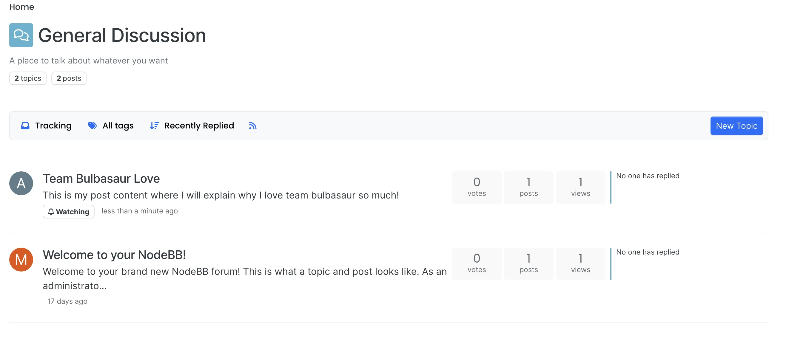

## User Story 1: Post Content Preview

To preview the content for a particular main post, navigate to any category page (e.g. *General Discussion*).
Here, for all existing topics, the first 100 characters of the main post content should be displayed under
the topic title as shown below.

If the content is less than or equal to 100 characters, then all of the content should be shown.
Conversely, if the content it greater than 100 characters, the first 100 will be displayed followed by a "..."
When a user creates a new topic as well, the main post's content preview should be immediately displayed
after navigating back to the category page. 

For user testing, a user may create new topics and submit content less than, greater than,
or at exactly 100 characters to post and see if the behavior described above holds on the category page.
Additionally, the user should always be able to visually see the content preview for all posts here. 

[**Our automated tests**]() case on the post content length being less than/equal to or greater than
100 characters. As mentioned previously, the former case would ensure that post preview content length
is the equal to that of the entire post content's. The latter case would gurantee that the post preview
content's length is equal to the first 100 characters of the actual post content followed by a "..."
We believe these tests are sufficent in terms of covering the changes we made as they align with
how we implemented and generated the post preview content in the first place. A user themselves should
be able to test visual changes on the site.  