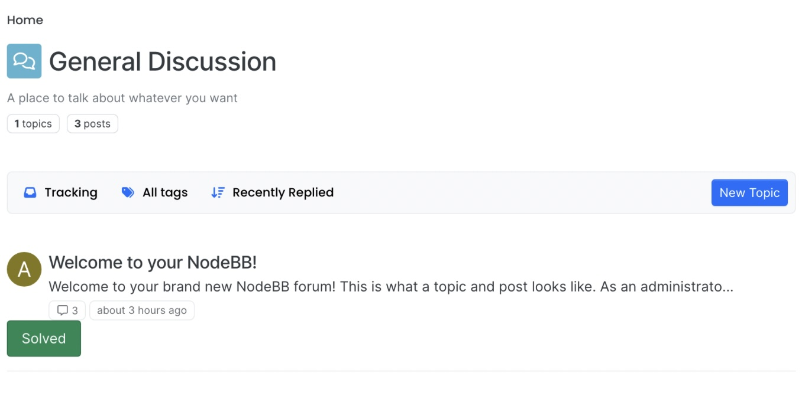
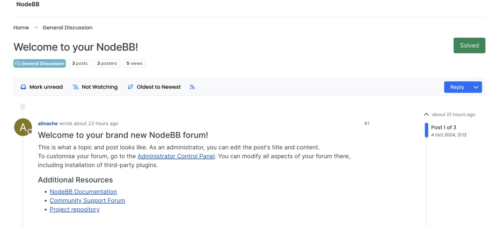
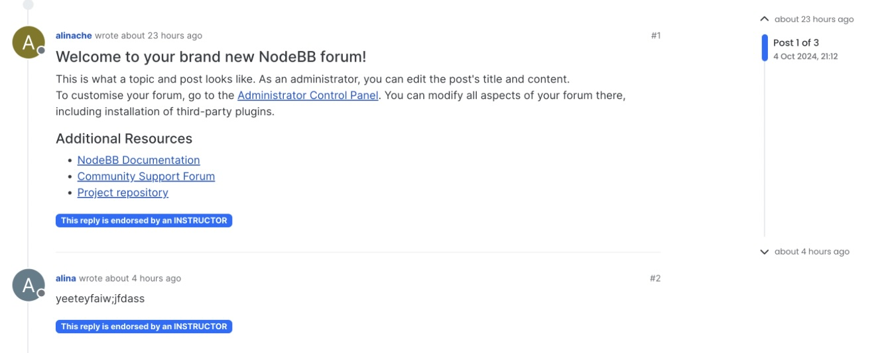
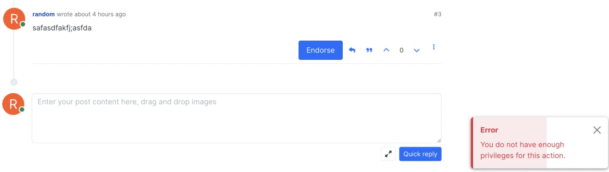

## User Story 1: Post Content Preview

### Using the Feature
To preview the content for a particular main post, navigate to any category page (e.g. *General Discussion*).
Here, for all existing topics, the first 100 characters of the main post content should be displayed under
the topic title as shown below.

If the content is less than or equal to 100 characters, then all of the content should be shown.
Conversely, if the content it greater than 100 characters, the first 100 will be displayed followed by a "..."
When a user creates a new topic as well, the main post's content preview should be immediately displayed
after navigating back to the category page. 

### User Testing
For user testing, a user may create new topics and submit content less than, greater than,
or at exactly 100 characters to post and see if the behavior described above holds on the category page.
Additionally, the user should always be able to visually see the content preview for all posts here.
The user can confirm if the preview content indeed aligns with the actual post content. 

### Automated Testing
[**Our automated tests**](test/topics.js) guarantees that the preview content of the first topic
on a categories page is equal to the actual content of the main post for that same topic according
to the specifications described above.
We believe these tests are sufficent in terms of covering the changes we made as they align with
how we implemented and generated the post preview content in the first place. A user themselves should
be able to visually confirm changes on the site.

## User Story 2: Mark Topic as Solved or Unsolved

### Using the Feature
To view whether a topic has been solved or unsolved, navigate to any category page (e.g. *General Discussion*).
You'll be able to see a button which indicates whether any topic from that category has been solved or unsolved.
Upon navigating into a specific topic to view posts under that topic, the main topic title will also display the button and to whether the topic has been solved or unsolved as well. The user can also choose to toggle the button between solved and unsolved on a topic page.

To toggle between solved and unsolved, simply click the "Solved" or "Unsolved" button and the change will be immediately reflected. The user has to be logged in to use this feature. If not, an error message will appear to alert the user that they have to be logged in.

### User Testing
While logged out, a user should click on the "Solved" or "Unsolved" button, and assert that an error message to prompt user to log in pops up when they click on the button.

While logged in, a user should click on the "Solved" or "Unsolved" after logged in, and assert that the button changes from "Solved" to "Unsolved" or vice versa. After refreshing the page, the button should continue stay at that state. Moreover,
the button state should be consistent between the categories page and the topic page, no matter which page the user clicked
the button on. 

### Automated Testing
[**Our automated tests**](test/topics.js) checks that between api calls of solved and unsolved, the actual value
in the database for the "solved" field of that topic toggles between 0 and 1 as we expect (0 for unsolved and 1 for solved). We also test that an error should be thrown if either this specific topic id doesn't exist or the user is 
not logged in (user id is 0).
We believe these tests are sufficent in terms of covering the changes we made as they align with
the aspects we implemented for this feature originally, including basing the button state off of a 
database value that toggles between 0 and 1 as well as throwing an error if a user is not logged in. 

## User Story 4: Mark Post as Endorsed

### Using the Feature
To view whether a post has been endorsed, navigate to any topic page.
If a particular post has been endorsed, you will see a blue banner with the text "This reply
is enorsed by an INSTRUCTOR." 
If a particular post has not been endorsed yet, yet you will a blue button with the text "Endorse." 
Clicking this button will mark the post as endorsed via the banner described above. However, user must be
logged in and have privileges as in instructor in order for this button click to be successful. Otherwise,
an error message will appear on NodeBB saying "You do not have enough privileges for this action."

### User Testing
While logged out or without privileges, a user should click on the Endorse button under a post, and assert that an error message pops up when they click on the button.

While logged in with privileges, a user should click on the "Endorse" button, and assert that the button disappears and the 
blue bannered text replaces it. After refreshing the page, the post should continue stay at that state.

### Automated Testing
[**Our automated tests**](test/posts.js) check that between an api call of endorse, the actual value
in the database for the "endorsed" field of that post has changed from 0 to 1 as we expect. We also test that an error
should be thrown if either the user is not an instructor (does not have admin nor moderator privileges) 
or the user is not logged in (user id is 0).
We believe these tests are sufficent in terms of covering the changes we made as they align with
the aspects we implemented for this feature originally, including basing the endorse state off of a 
database value that is initially 0 and can only change to 1, as well as throwing errors if the user
is not logged in or has no privileges.
